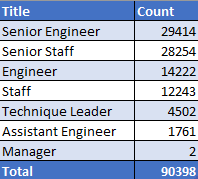
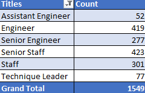

# Pewlett-Hackard-Analysis 

## Overview of the analysis
  
  1) Determine the number of retirement-age employees by most recent job title. 
  
  2) Identify employees who are eligible to participate in the mentorship program. 
  
## Results

  1) 90,398 of the 300,024 employees (30.1%) are of retirement age.
  
  2) 63.8% of retirement age employees are Senior Engineers or Senior Staff. 
  
      
  
  3) Under the current parameters of the mentorship program, only 1,549 are eligible to participate. 
  
  4) Managers, Assistant Engineers, and Technique Leaders have the fewest number of individuals eligible to become mentors.
  
      

## Summary

  - How many roles will need to be filled as the "silver tsunami" begins to make an impact?
  
    - 90,398 roles will need to be filled.

  - Are there enough qualified, retirement-ready employees in the departments to mentor the next generation of Pewlett Hackard employees?
  
    - No, with the current parameters on the mentorship program there are only 1,549 qualified, retirement-ready employees to mentor the next generation, which is not enough. 
  
  - Two additional queries to provide more insight on the upcoming "silver tsunami"

    1) Breakout the number of retirement-age employees by most recent title by each department.

    2) To accelerate the mentorship of future generations, rerun the mentorship-eligibility table with an expanded age range to determine the number of mentor-eligible employees who were born between January 1, 1965 and December 31, 1970.
    
## Data Sources

  - [Employee_Database_challenge.sql](Queries/Employee_Database_challenge.sql)
  - [retiring_titles](Data/retiring_titles.csv)
  - [mentorship_eligibility](Data/mentorship_eligibility.csv)
  
